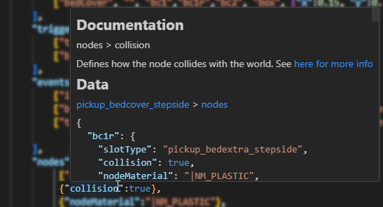
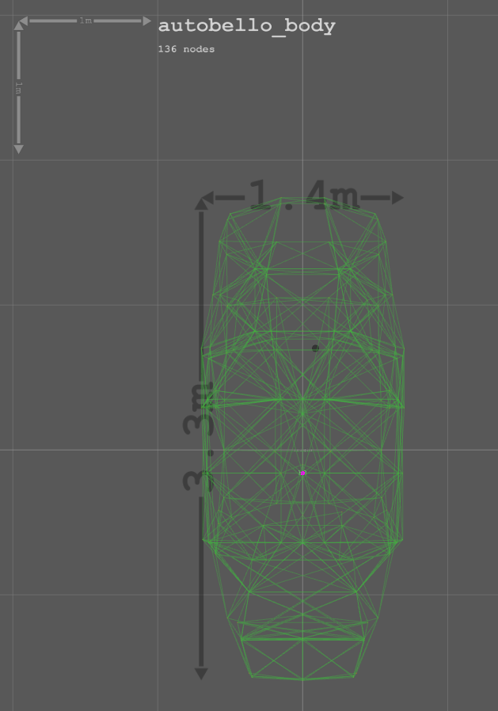

# BeamNG JBeam Editor

This is a lightweight visualizer and tool for working with the physics definition files of BeamNG (called jbeam).

**[Install via the Visual Studio Code marketplace here](https://marketplace.visualstudio.com/items?itemName=beamng.jbeam-editor)**

**Project contributors, please read [contributing.md](https://github.com/BeamNG/vscode-jbeam-editor/blob/master/contributing.md)!**

# ⚠️ Experimental ⚠️

**Warning:** this plugin is still very experimental and might crash. We are working on bugfixes and stability improvements

## Features

* custom syntax for jbeam that ignores missing commas

  

* Outline / Symbol provider: you can jump between parts and sections with the outline window

  

* Custom Json / JBeam parsing that is very close to the actual used parer that provides more useful errors and warnings with ranges

  

  

* Extensive hover information: the parsed object and a clickable breadcrumb

  

  

  

* Documentation integration to lookup the value, key and path of the hovered item in the docs to provide useful information.
  Currently looks for the breadcrumb: `beams > optional`, the key of the hovered item `beams > id2` or the word itself `FLT_MAX`

  

* 3D Preview of the JBeam

  

  

  

* Node multi selection

  

* Beam multi selection

  

* Mesh multi selection

  

* Node translation gizmo support

  

* Flexmesh translation / rotation support

  

* Mirror planes and symmetry detection (with error support)

  

  

* Ground smart helper

  

  

* visualize current part or all parts

  

* triangle visualization

  

* Settings shortcut in the top right corner:

  

* Extensive settings, live updating the 3D scene as well:

  

  

* BeamNG Log file syntax highlighter and parser included

  

## Known Issues

* Mesh functions are a bit unstable still. Especially if you change tabs, etc while it loads the data.

## Wishlist

* JBeam beautifier: clean up the file, format everything nicely
* autocomplete part names in PC files
* make grid and ground plane being as big as the vehicle at least for big vehicles
* mesh opacity user-setable
* implementation of props
* picking flexbodies in 3d space
* working slot system: part chain loading support, part config (PC) loading
* better support for sections: slidenodes, rails, triangles, wheels, refNodes, camera*, torsionbars
* powertrain viz
* trigger viz
* variables debug UI
* specific help for sections using proper error checking and links to documentation

* Robustness and future-proofing: Add exception handling and error mitigation to the code so it will continue working in the future
* zip mod loading?
* convert all JS files to proper JS modules / remove hacks
* implement more providers from [here](https://code.visualstudio.com/api/language-extensions/programmatic-language-features)
* use more icons throughout the UI: [from here](https://microsoft.github.io/vscode-codicons/dist/codicon.html)
* multi-line selection of elements also working in 3d space

* direction connection to BeamNG: sync/reload automatically
* highlighting of scopes
* dedicated data view
* dedicated documentation view
* walkthrough: https://code.visualstudio.com/api/references/contribution-points#contributes.walkthroughs
* getting started page

## Requirements

None

## Troubleshooting

### JBeam file association
If the file association does not work out of the box, pelase configure your setup:

1) Open a jbeam file. On the bottom right corner of the window, click on the language mode:

   
2) In the resulting popup, select `Configure File Association for '.jbeam'`:

   

3) enter `jbeam` - It should look like this:

   

If all worked, it should show up like this now:

## Release Notes

### 0.4.3
* Bugfixes:
  * Tweaked tooltip size
  * Fixed node positions displayed in wrong coordinate system
  * Fixed visualization status bar being larger than it should be, which was preventing a large portion of the UI from being interactable
  * Rounding node position to 3 decimal places after moving nodes

### 0.4.2
* Features:
  * Tweaked node visualization tooltip size
  * Tweaked BeamNG connection status bar message

### 0.4.1
* Features:
  * Added status bar button to toggle connecting with BeamNG

### 0.4.0
* Features:
  * Node translation gizmo support - now you can translate nodes with a gizmo

    

  * Flexmesh translation / rotation support - now fits the visualization in the simulation

    
  * new 3D view toolbar - quick switches for most commonly used tools

    

  * Mirror planes and symmetry support - highlights nodes across any detected mirror planes

    

  * Symmetry error detection - detects where the symmetry across mirror planes seems to be broken

    

  * JBeam legend pane - shows a legend of the JBeam types and colors

    

  * Hydro and torsion hydro visualization
  * Font changed to Cascadia Code for better readability

### 0.3.92
* Bugfixes:
  * Duplicate beam detector now works pretty much like in game

### 0.3.91
* Bugfixes:
  * Duplicate beam detector now works like in game

### 0.3.9
* Bugfixes:
  * Fixed JBeam file/parts counter
  * Fixed JBeam diagnostics clearing on closing file
  * Tweaked diagnostic message for duplicate beams and degenerate triangles a bit

### 0.3.8
* Bugfixes:
  * Fixed bug where "tableSchema" processing didn't happen due to even just JSON warnings existing, which isn't a problem to process.
* Features:
  * added duplicate beam detection for current file
  * added degenerate triangle detection

### 0.3.7
* Bugfixes:
  * fixed jbeam being hidden under z=0 plane
  * fixed node label resizing in perspective mode when rotating camera
  * no longer rendering "virtual" jbeam objects as it can be confusing
* Features:
  * added torsion bar visualization
  * added a setting "Show Node IDs" to show node ids regardless of where your cursor is in the jbeam file
  * "focus Selected JBeam" enabled by default and works with other JBeam objects

### 0.3.6
* Bugfixes:
  * tweaked node sizing
  * tweaked node label sizing in orthographic mode

### 0.3.5
* Bugfixes:
  * fixed plugin not working under Linux
* Features:
  * now mouse double click in order to select nodes
  * added ability toggle focusing on selected nodes (off by default)

### 0.3.4
* Bugfixes:
  * fixed bug with duplicate diagnoses, when the archivar processes all jbeam files, and then you open a jbeam file, and you modify it
  * fixed showing nodes in 3D view from a different vehicle
  * ignore processing "slotType" with "processTableWithSchemaDestructive"
  * in 3D scene view, virtual nodes colored blue and have "(v)" appended to the node name
  * fixed JBeam files parsed counter
  * fixed parsing jbeam/sjson files that don't have an outer object
  * more parsing bugs fixed
  * fixed/updated jbeam/part config file icons thanks to [Sopze92](https://github.com/Sopze92)

### 0.3.3
* Bugfixes:
  * fixed syntax checker not working in some cases
  * fixed displaying duplicate diagnostics
  * fixed JBeam file/part counter
* Features:
  * added ability to detect duplicate dictionary keys

### 0.3.2
* Bugfixes:
  * fixed tooltip textures not updating correctly
  * improved label scaling
  * improved error handling on sim sync
  * fixed CTRL + SHIFT + P : "Sync with simulation"
  * improved simconnection protocol to have message identifiers and lengths

### 0.3.1
* Bugfixes:
  * fixed node selection scrolling the viewport when leaving and re-entering the 3D view

### 0.3.0
* Bugfixes:
  * improved groundplane size for large models
  * improved stability
  * nodes are picked in 2d space for better accurancy
  * exchanged left/right mouse button for pan/rotate
  * fixed node sizes in orthographic view
  * fixed json number parsing for numbers with a leading plus sign
* Features:
  * completely new json parser with better and improved metadata support and improved error diagnostics
  * added 3D line to mark the origin 0,0,0
  * beamng.log parser
  * triangles are not visible unless editing that section
  * only show 3d meshes if in flexbodies section
  * support for floating 3D labels. Used to display node names right now
  * added simconnection: will connect to the simulation and interact with it (if running)
  * added knowledge of all existing jbeam files for part finding reasons
  * added partconfig parsing and completion basics - experimental

### 0.2.5
* Bugfixes:
  * fixed empty sections crashing the parser
  * improved error handling sjson/table parsing
  * improved stability with multiple webviews open
  * improved stability with changing documents
  * fixed memory leaks due to improper geometry/material management
  * Fixed meshes disappearing: fixed normal and bounds calculation

* Features:
  * Added extension settings. Open with `Open Settings` on top right corner
  * Added new settings
    * Enable/Disable hover
    * Enable/Disable hover highlight with the breadCrumb
    * Enable/Disable hover documentation
    * Enable/Disable hover data
    * Enable/Disable mesh default loading
    * FPS Limit
    * Load common folder

### 0.2.4
* fixed leaking `options` in the table parser
* removed ground floor for now
* implemented `triangles` section visualizer

### 0.2.3
* Improved readme a bit

### 0.2.2
* Remove icon theme to not overwrite any user themes

### 0.2.1
* Fixed Mesh loading crashing when the opened file is outside the workspace. Enforcing a workspace now and showing an error message.

### 0.2
* fixed documentation a bit up

### 0.1
Initial release :)
