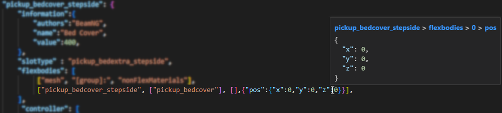
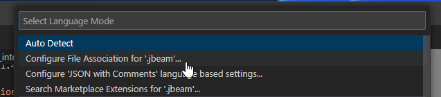

# BeamNG JBeam editor

This is a lightweight visualizer and tool for working with the physics definition files of BeamNG (called jbeam).

# ⚠️ Experimental ⚠️

**Warning:** this plugin is still very experimental and might crash. We are working on bugfixes and stability improvements

## Features

* custom syntax for jbeam that ignores missing commas

  

* Outline / Symbol provider: you can jump between parts and sections with the outline window

  

* Custom Json / JBeam parsing that is very close to the actual used parer that provides more useful errors and warnings with ranges

  

  

* Extensive hover information: the parsed object and a clickable breadcrumb

  

  

  

* Documentation integration to lookup the value, key and path of the hovered item in the docs to provide useful information.
  Currently looks for the breadcrumb: `beams > optional`, the key of the hovered item `beams > id2` or the word itself `FLT_MAX`

  

* 3D Preview of the JBeam

  

  

  
  
* Node multi selection

  

* Beam multi selection

  

* Mesh multi selection

  

* Ground smart helper

  

  

* visualize current part or all parts

  

 
## Known Issues

* Mesh functions are a bit unstable still. Especially if you change tabs, etc while it loads the data.

## Wishlist

* autocomplete part names in PC files
* make grid and ground plane being as big as the vehicle at least for big vehicles
* mesh opacity user-setable
* implementation of props
* picking flexbodies in 3d space
* working slot system: part chain loading support, part config (PC) loading
* better support for sections: slidenodes, rails, triangles, wheels, refNodes, camera*, torsionbars
* powertrain viz
* trigger viz
* variables debug UI
* specific help for sections using proper error checking and links to documentation

* Robustness and future-proofing: Add exception handling and error mitigation to the code so it will continue working in the future
* zip mod loading?
* convert all JS files to proper JS modules / remove hacks
* implement more providers from [here](https://code.visualstudio.com/api/language-extensions/programmatic-language-features)
* use more icons throughout the UI: [from here](https://microsoft.github.io/vscode-codicons/dist/codicon.html)
* multi-line selection of elements also working in 3d space

## Requirements

None. The parser, etc is standalone from BeamNG.

## Known Issues

Calling out known issues can help limit users opening duplicate issues against your extension.

## Troubleshooting

### JBeam file association
If the file association does not work out of the box, pelase configure your setup:

1) Open a jbeam file. On the bottom right corner of the window, click on the language mode:

   
2) In the resulting popup, select `Configure File Association for '.jbeam'`:

   

3) enter `jbeam` - It should look like this:

   

If all worked, it should show up like this now:

## Release Notes

### 0.2.1
* Fixed Mesh loading crashing when the opened file is outside the workspace. Enforcing a workspace now and showing an error message.

### 0.2
* fixed documentation a bit up

### 0.1
Initial release :)
