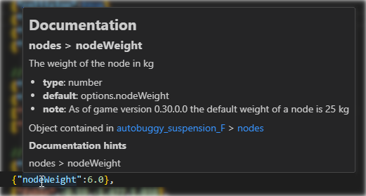

# BeamNG Jbeam editor

This is the README for your extension "jbeam-editor". After writing up a brief description, we recommend including the following sections.

## Features

* custom icons for BeamNG file types

  

* custom syntax for jbeam that ignores missing commas

  

* Outline / Symbol provider: you can jump between parts and sections with the outline window

  

* Custom Json / JBeam parsing that is very close to the actual used parer that provides more useful errors and warnings with ranges

  

  

* Extensive hover information: the parsed object and a clickable breadcrumb

  

  

  

* Documentation integration to lookup the value, key and path of the hovered item in the docs to provide useful information.
  Currently looks for the breadcrumb: `beams > optional`, the key of the hovered item `beams > id2` or the word itself `FLT_MAX`

  

* 3D Preview of the JBeam

  

  

  
  
* Node multi selection

  

* Node multi selection

  

## WIP

* part selection: which part is displayed
* implementation of props
* picking flexbodies in 3d space
* multi-line selection of elements also selecting in 3d space
* improved imgui info windows: click on elements and jump to the range in the text editor
* working slot system: part chain loading support
* part config (PC) loading
* better support for sections: slidenodes, rails, triangles, wheels, refNodes, camera*, torsionbars
* powertrain viz
* trigger viz
* variables debug UI
* specific help for sections using proper error checking and links to documentation
* Robustness and future-proofing: Add exception handling and error mitigation to the code so it will continue working in the future
* zip mod loading?
* convert all JS files to proper JS modules / remove hacks
* implement more providers from [here](https://code.visualstudio.com/api/language-extensions/programmatic-language-features)
* use more icons throughout the UI: [from here](https://microsoft.github.io/vscode-codicons/dist/codicon.html)

## Requirements

Have BeamNG installed

## Known Issues

Calling out known issues can help limit users opening duplicate issues against your extension.

## Release Notes

### 0.1

Initial release :)
